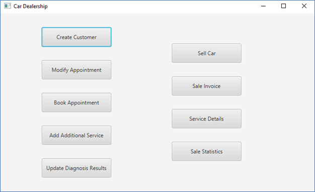
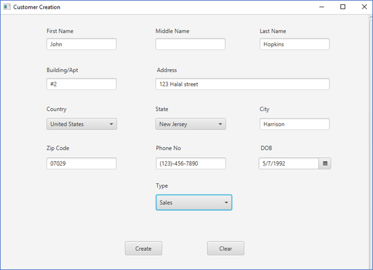
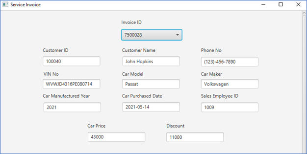
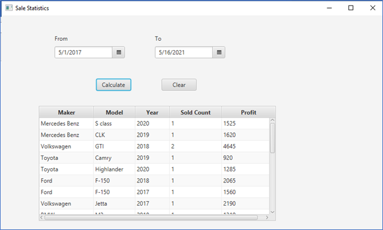
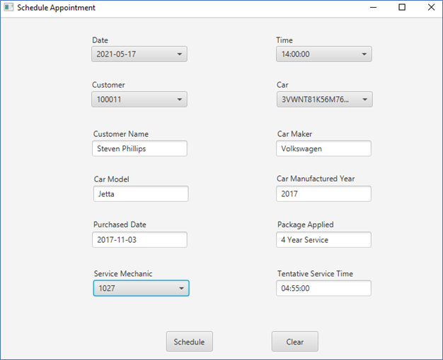
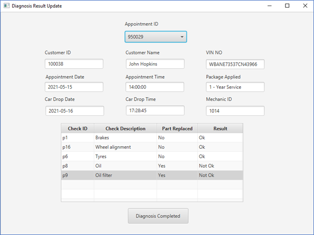
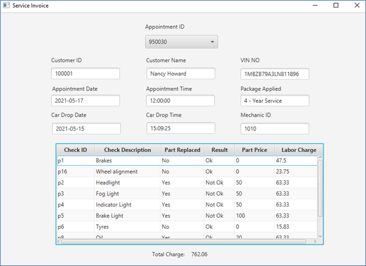

# Car Dealership CRM Desktop Application  

 A simple desktop application using Java to allow the car dealers to perform the following CRM services: <b>Car Sales, Car Service Scheduling & Rendering, Car Sale Statistics</b> 

## Screenshots

### `Home Screen`  

### `New Customer Creation`  

### `Generate Sale Invoice`  

### `Generate Sale Statistics`  

### `Schedule Service Appointment`  

### `Car Diagnosis Report`  

### `Service Invoice`  

